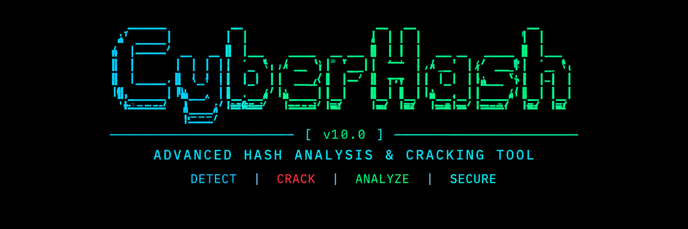

# ⚡ CyberHash

<p align="center">
  
  <br><br>
  🔐 <b>CyberHash — High Performance Hash Analysis & Verification Platform</b>
  <br>
  🚀 Built for security research, password audit verification, and hash identification.
</p>

---

## 📄 Table of Contents
- [Project Overview](#-project-overview)
- [Feature List](#-feature-list)
- [Architecture](#-architecture)
- [Installation & Setup](#-installation--setup)
  - [Windows Setup](#windows-setup)
  - [Linux Setup](#linux-setup)
  - [macOS Setup](#macos-setup)
- [Wordlist Management & Behavior](#-wordlist-management--behavior)
  - [Sample Wordlist Behavior](#sample-wordlist-behavior)
  - [rockyoutxt Discovery](#rockyoutxt-discovery)
- [Command-Line Interface Reference](#-command-line-interface-reference)
- [Attack Modes](#-attack-modes)
  - [1. Dictionary Attack](#1-dictionary-attack)
  - [2. Rule Engine Mutation](#2-rule-engine-mutation)
  - [3. Mask Attack](#3-mask-attack)
  - [4. Hybrid Attack](#4-hybrid-attack)
- [Session Management & Recovery](#-session-management--recovery)
- [Benchmarking](#-benchmarking)
- [Wordlist Statistics](#-wordlist-statistics)
- [Batch Processing](#-batch-processing)
- [Result Export Formats](#-result-export-formats)
- [Configuration System](#-configuration-system)
- [Usage Examples](#-usage-examples)
- [Testing](#-testing)
- [Troubleshooting](#-troubleshooting)
- [Platform Compatibility](#-platform-compatibility)
- [Project Structure](#-project-structure)
- [License](#-license)
- [Responsible & Authorized Use Statement](#-responsible--authorized-use-statement)

---

## 🧠 Project Overview

CyberHash is a modular, high-performance Python-based command line platform for hash verification, identification, and password audit testing. It implements clean multi-threaded and multi-process candidate generation pipelines, composable mutation rules, mask pattern expansion, atomic session checkpointing, and structured result exports (JSON, CSV, TXT).

CyberHash requires **no administrator privileges**, enforces bounded memory queues, and operates cross-platform across Windows, Linux, and macOS.

---

## ✨ Feature List

- **Multi-Algorithm Identification**: Automatically resolves candidate algorithms based on hash signatures and lengths (MD5, SHA1, SHA256, SHA512, SHA3-256, NTLM, BCRYPT, MD5-CRYPT, SHA256-CRYPT, SHA512-CRYPT).
- **Streaming Dictionary Engine**: Stream candidate lines sequentially across single or multiple wordlists without loading whole files into RAM.
- **Rule Mutation Engine v2**: Composable rule transformations (`lowercase`, `uppercase`, `capitalize`, `reverse`, `leetspeak`, `substitute`, `append_digits`, `year_suffix`, etc.) up to arbitrary composition depth.
- **Mask & Hybrid Engines**: Pattern expansion (`?l`, `?u`, `?d`, `?s`, custom strings, presets) and combined wordlist + mask generation.
- **Atomic Session Management**: Stable hash-based session identifiers, `.tmp` atomic state writes, resume checkpointing, list, delete, and clear options.
- **Distributed Cracking**: Multi-process worker splitting across wordlist byte ranges.
- **Performance Benchmarking**: Isolated per-algorithm speed benchmarking (ops/sec) with Rich terminal summary tables.
- **Wordlist Statistics**: In-depth streaming metadata calculation (unique lines, duplicate count, line lengths, character distribution).
- **Batch Processing**: Sequential error-isolated verification of target hash files (`--hash-file`).
- **Structured Exporters**: Automatic export format dispatching (`.json`, `.csv`, `.txt`, `.log`).

---

## 📐 Architecture

CyberHash adopts a modular, layered architecture:

```
                  ┌─────────────────────────────────┐
                  │            CLI Layer            │
                  │       (cyberhash/cli.py)        │
                  └────────────────┬────────────────┘
                                   │
         ┌─────────────────────────┼─────────────────────────┐
         ▼                         ▼                         ▼
┌──────────────────┐    ┌──────────────────┐    ┌──────────────────┐
│  Attack Engines  │    │ Session Manager  │    │ Wordlist Manager │
│ (dict/mask/hybr) │    │(session/manager) │    │(wordlists/mngr)  │
└────────┬─────────┘    └────────┬─────────┘    └────────┬─────────┘
         │                       │                       │
         └───────────────────────┼───────────────────────┘
                                 ▼
                    ┌─────────────────────────┐
                    │       Core Layer        │
                    │  (detector / verifier   │
                    │      hash_engine)       │
                    └─────────────────────────┘
```

---

## 📦 Installation & Setup

### Windows Setup
```powershell
git clone https://github.com/Bhuvaneshkumar1/cyberhash.git
cd cyberhash
python -m pip install -r requirements.txt
python -m pip install -e .
cyberhash --version
```

### Linux Setup
```bash
git clone https://github.com/Bhuvaneshkumar1/cyberhash.git
cd cyberhash
python3 -m pip install -r requirements.txt
python3 -m pip install -e .
cyberhash --version
```

### macOS Setup
```bash
git clone https://github.com/Bhuvaneshkumar1/cyberhash.git
cd cyberhash
python3 -m pip install -r requirements.txt
python3 -m pip install -e .
cyberhash --version
```

---

## 📂 Wordlist Management & Behavior

### Sample Wordlist Behavior
On systems without explicit `--wordlist` input (Windows, macOS, or Linux without system wordlists), CyberHash automatically generates a sample wordlist at the user app data directory:
- **Windows**: `%LOCALAPPDATA%\.cyberhash\sample_wordlist.txt`
- **Linux / macOS**: `~/.cyberhash/sample_wordlist.txt`

### rockyou.txt Discovery
On Linux, CyberHash automatically detects system `rockyou` wordlists in standard locations:
- `/usr/share/wordlists/rockyou.txt`
- `/usr/share/wordlists/rockyou.txt.gz`
- `/usr/share/seclists/Passwords/Leaked-Databases/rockyou.txt`
- `/usr/share/seclists/Passwords/Leaked-Databases/rockyou.txt.gz`

Transparent gzip decompression allows direct streaming of `.gz` files without manual extraction.

---

## ⚙️ Command-Line Interface Reference

```
Target & Input Options:
  --hash HASH               Single target hash string to analyze/verify
  --hash-file FILE          Path to text file containing target hashes (one per line)
  --algo ALGORITHM          Manually specify target hash algorithm (e.g. MD5, SHA256)

Wordlist Options:
  --wordlist FILE           Custom single wordlist file path
  --wordlists F1 F2...      Multiple wordlist file paths
  --wordlist-info [PATH]    Display metadata & statistics for wordlist
  --stats                   Display statistics for target wordlist
  --generate-wordlist       Generate bundled sample wordlist and output path

Attack & Mutation Options:
  --mask MASK               Mask pattern string (e.g. '?l?l?d?d') or preset name
  --hybrid                  Enable hybrid dictionary + mask attack mode
  --hybrid-mode MODE        Hybrid mask positioning ('suffix', 'prefix', 'both')
  --hybrid-max-per-word N   Maximum mask variations per word (default: 1000)
  --rules                   Enable rule engine password mutations
  --rules-only              Run only rule-mutated candidates
  --rules-file FILE         Path to custom rule transformation text file
  --rule-depth N            Composition depth for rule engine (default: 1)

Performance & Distributed Options:
  --threads N               Number of worker threads (default: 4)
  --distributed N           Number of multi-process worker processes

Session Management Options:
  --resume                  Resume state for current target hash
  --session-id ID           Explicit session ID to checkpoint or resume
  --session-list            List all stored saved session checkpoints
  --session-resume ID       Resume specific saved session checkpoint by ID
  --session-delete ID       Delete specific saved session checkpoint by ID
  --session-clear           Clear all stored session checkpoint files

Benchmarking Options:
  --benchmark               Run algorithm performance benchmark
  --benchmark-duration N    Time budget in seconds per algorithm test (default: 1.0)

Output & Formatting Options:
  --export FILE             Output file path for crack/batch results (.json, .csv, .txt)
  --quiet                   Suppress non-essential console logs and banner
  --verbose                 Enable verbose execution output
  --debug                   Enable debug logging output
  --no-color                Disable ANSI color styling in console output

Configuration & Information Options:
  --config FILE             Path to custom JSON configuration file
  --show-config             Display active configuration settings
  --version                 Display CyberHash version and exit
```

---

## 🧨 Attack Modes

### 1. Dictionary Attack
Stream plain text candidate words against resolved target algorithms.
```bash
cyberhash --hash 5f4dcc3b5aa765d61d8327deb882cf99 --wordlist wordlists/default_wordlist.txt
```

### 2. Rule Engine Mutation
Apply composable rule mutations (`lowercase`, `uppercase`, `capitalize`, `reverse`, `leetspeak`, `substitute`, `append_digits`, `year_suffix`, etc.).
```bash
cyberhash --hash 482c811da5d5b4bc6d497ffa98491e38 --wordlist wordlists/default_wordlist.txt --rules --rule-depth 2
```

### 3. Mask Attack
Generate candidates from character set patterns or presets (`simple_numeric`, `common_password`, etc.).
```bash
cyberhash --hash c20ad4d76fe97759aa27a0c99bff6710 --mask "?d?d"
```

Mask Symbols:
- `?l` : Lowercase letters (`a-z`)
- `?u` : Uppercase letters (`A-Z`)
- `?d` : Digits (`0-9`)
- `?s` : Special symbols (`!@#$%^&*`)

### 4. Hybrid Attack
Combine wordlist base words with mask pattern variations.
```bash
cyberhash --hash 1844156d4166d94387f1a4ad031ca5fa --wordlist wordlists/default_wordlist.txt --mask "?d?d" --hybrid --hybrid-mode suffix
```

---

## ♻️ Session Management & Recovery

Save and resume state checkpoints atomically using deterministic session IDs.
```bash
# List all active sessions
cyberhash --session-list

# Resume a specific session checkpoint
cyberhash --session-resume sess_5f4dcc_dictionary_3b5aa765

# Delete or clear sessions
cyberhash --session-delete sess_5f4dcc_dictionary_3b5aa765
cyberhash --session-clear
```

---

## 📊 Benchmarking

Run performance speed tests across supported fast algorithms.
```bash
cyberhash --benchmark --benchmark-duration 1.0
```

---

## 📈 Wordlist Statistics

Compute comprehensive wordlist metadata and character breakdown.
```bash
cyberhash --wordlist-info wordlists/default_wordlist.txt
```

---

## 📑 Batch Processing

Verify multiple hashes listed in a text file sequentially with error isolation.
```bash
cyberhash --hash-file hashes.txt --wordlist wordlists/default_wordlist.txt --export batch_results.json
```

---

## 📤 Result Export Formats

CyberHash automatically selects export format from destination file extensions:
- **JSON (`.json`)**: Formatted JSON object containing target, algorithm, candidate, method, tested count, elapsed seconds, and ISO timestamp.
- **CSV (`.csv`)**: Structured tabular row matching JSON schema.
- **TXT (`.txt` / `.log`)**: Human-readable analysis report.

---

## ⚙️ Configuration System

Create a `cyberhash.json` configuration file to set default application preferences:
```json
{
  "threads": 8,
  "default_wordlist": "wordlists/default_wordlist.txt",
  "rule_depth": 2,
  "output_format": "table",
  "quiet": false,
  "verbose": false,
  "logging": true,
  "session_directory": null
}
```

Display active configuration:
```bash
cyberhash --show-config
```

---

## 💡 Usage Examples

```bash
# 1. Simple Hash Verification
cyberhash --hash 5f4dcc3b5aa765d61d8327deb882cf99 --quiet

# 2. Rule Engine Mutation with Multiple Wordlists
cyberhash --hash 5f4dcc3b5aa765d61d8327deb882cf99 --wordlists wl1.txt wl2.txt --rules --threads 8

# 3. Mask Attack using Numeric Preset
cyberhash --hash c20ad4d76fe97759aa27a0c99bff6710 --mask simple_numeric

# 4. Hybrid Attack Exported to JSON
cyberhash --hash 1844156d4166d94387f1a4ad031ca5fa --wordlist wl.txt --mask "?d?d" --hybrid --export result.json
```

---

## 🧪 Testing

Execute the automated test suite:
```bash
pytest -q
```

---

## ❓ Troubleshooting

- **Configuration File Not Found Error**: Ensure the file path passed to `--config` exists.
- **Wordlist File Not Found Error**: Verify that user-supplied wordlist paths exist.
- **Permission Errors**: CyberHash writes only to user app data (`~/.cyberhash` or `%LOCALAPPDATA%\.cyberhash`). No elevated/administrator permissions are required.

---

## 🌐 Platform Compatibility

For complete platform-specific behavioral specifications, review [docs/PLATFORM_SUPPORT.md](file:///d:/cyberhash/docs/PLATFORM_SUPPORT.md) and [docs/SECURITY_AUDIT.md](file:///d:/cyberhash/docs/SECURITY_AUDIT.md).

---

## 📁 Project Structure

```
cyberhash/
├── cyberhash/
│   ├── __init__.py
│   ├── __main__.py
│   ├── cli.py
│   ├── config.py
│   ├── attacks/
│   │   ├── dictionary.py
│   │   ├── distributed.py
│   │   ├── hybrid.py
│   │   ├── mask.py
│   │   └── rules.py
│   ├── benchmark/
│   │   └── engine.py
│   ├── core/
│   │   ├── batch.py
│   │   ├── detector.py
│   │   ├── hash_engine.py
│   │   ├── resolver.py
│   │   └── verifier.py
│   ├── output/
│   │   ├── console.py
│   │   ├── csv_export.py
│   │   ├── exporter.py
│   │   ├── json_export.py
│   │   └── txt_export.py
│   ├── session/
│   │   └── manager.py
│   ├── utils/
│   │   ├── logging.py
│   │   └── platform.py
│   └── wordlists/
│       ├── manager.py
│       └── statistics.py
├── docs/
│   ├── PLATFORM_SUPPORT.md
│   └── SECURITY_AUDIT.md
├── tests/
├── wordlists/
│   └── default_wordlist.txt
├── requirements.txt
├── setup.py
└── README.md
```

---

## 📜 License

This project is licensed under the MIT License - see the `LICENSE` file for details.

---

## ⚠️ Responsible & Authorized Use Statement

CyberHash is provided strictly for **authorized security audit verification, academic research, and defensive password policy analysis**. Using CyberHash against targets without explicit prior authorization from system owners is strictly prohibited. Users are solely responsible for ensuring compliance with applicable laws and security policies.
